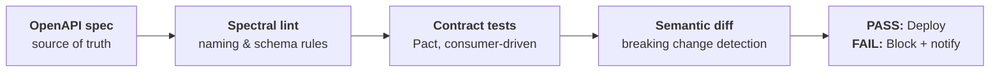

# Contract-First APIs in the Age of Agents — Example Schemas

Companion repository for the talk [**"Contract-First APIs in the Age of Agents"**](https://github.com/TaleLearnCode/ContractFirstAPIsInTheAgeOfAIAgents) by Chad Green ([chadgreen.com](https://www.chadgreen.com)).

Your API now has two kinds of consumers. A human developer reads between the lines. An AI agent executes literally, with no exceptions. **Ambiguity a human navigates becomes an outage an agent creates.**

This repo contains the three patterns from the talk as OpenAPI 3.1 contracts, each in a **before** state (the contract that failed Brittany on Monday morning) and an **after** state (the agent-ready contract), with a governance pipeline that proves the difference. Take them, use them, adapt them.

## The patterns

| # | Guide | Principle | Before → After |
|---|---|---|---|
| 01 | [**The Status Enum Pattern**](docs/01-status-enum-pattern.md) | Make the happy path boring | [before](schemas/status-enum/before.openapi.yaml) · [after](schemas/status-enum/after.openapi.yaml) |
| 02 | [**The Structured Error Schema**](docs/02-structured-error-schema.md) | Your error is an agent's next step | [before](schemas/error-schema/before.openapi.yaml) · [after](schemas/error-schema/after.openapi.yaml) |
| 03 | [**The Idempotency-Key Header**](docs/03-idempotency-key-header.md) | Agents will retry. Make it safe. | [before](schemas/idempotency-key/before.openapi.yaml) · [after](schemas/idempotency-key/after.openapi.yaml) |

Each guide stands on its own: the story, the principle, a walkthrough of the before-and-after contracts, the governance that enforces it, and a checklist for applying it to your own API. Read them in any order.

**What you will find in each guide**

- **01 — Status enums.** Why `status: "ok"` double-booked Brittany; closed enums with a documented meaning per value; explicit nullability (always present, sometimes `null`); the async `202` + poll pattern; one pagination vocabulary; why a new status value is a breaking change and how CI catches it.
- **02 — Error schema.** Why "Something went wrong. Please try again." caused a six-retry loop; the `error_code` / `message` / `retryable` / `retry_after` / `remediation` schema; why `retryable` describes the occurrence and not the code; extensible error codes vs. closed status enums; mapping to RFC 9457 Problem Details.
- **03 — Idempotency-Key.** Why a correct retry created a second booking and a second charge; stating the guarantee in the parameter, the description, and a machine-readable extension; replay, in-progress, and key-reuse semantics; an optional-then-required rollout that avoids breaking existing clients.

## Brittany's Monday morning, resolved

Every failure in the story traces to a gap in the contract, and every gap has a named fix in this repo.

| What went wrong | Contract-first fix | Where |
|---|---|---|
| **False success** — `status: "ok"`; the agent could not tell confirmed from pending | Enums and deterministic schemas: `PENDING \| CONFIRMED \| FAILED` | [01](docs/01-status-enum-pattern.md) |
| **Duplicate charge** — no idempotency key; the retry created a second booking | `Idempotency-Key` header documented in the contract; retries reuse the key | [03](docs/03-idempotency-key-header.md) |
| **Retry loop ×6** — unstructured "Something went wrong" | Actionable error schema with `retryable` and `remediation` | [02](docs/02-structured-error-schema.md) |
| **No audit trail** — no trace IDs across the multi-call chain | `X-Correlation-ID`, `X-Request-ID`, and W3C `traceparent` on every response | All *after* files; lint rule `agent-trace-headers-on-every-response` |
| **Breaking change** reached production undetected | Lint + semantic diff + consumer-driven contract tests in CI | [Governance](#governance) and section 5 of every guide |

## Repository layout

```text
.
├── README.md                          ← you are here
├── docs/
│   ├── 01-status-enum-pattern.md
│   ├── 02-structured-error-schema.md
│   └── 03-idempotency-key-header.md
├── schemas/
│   ├── status-enum/
│   │   ├── before.openapi.yaml
│   │   └── after.openapi.yaml
│   ├── error-schema/
│   │   ├── before.openapi.yaml
│   │   └── after.openapi.yaml
│   └── idempotency-key/
│       ├── before.openapi.yaml
│       └── after.openapi.yaml
├── governance/
│   ├── agent-ready.spectral.yaml      ← the style guide, as lint rules
│   └── examples/
│       └── status-enum.breaking-change.openapi.yaml   ← a change CI must block
├── scripts/
│   ├── lint.ps1                       ← after must pass, before must fail
│   └── breaking-check.ps1             ← semantic diff + semver gate
├── .github/workflows/contract-governance.yml
└── .spectral.yaml                     ← lets a bare `spectral lint` pick up the ruleset
```

### How the examples are built

- **Every pair is a controlled experiment.** A *before* file and its *after* file differ **only** in the principle being taught. Everything else is already agent-ready in both. `diff schemas/error-schema/before.openapi.yaml schemas/error-schema/after.openapi.yaml` shows the error design and nothing else.
- **Every *after* file is a complete, self-contained contract.** Copy one file into your project and it lints, validates, and renders on its own. The shared pieces (the `Error` schema, trace headers, the `Idempotency-Key` parameter) are repeated in each file on purpose so you do not have to chase `$ref`s across files.
- **Every example validates.** Spectral's built-in `oas3-valid-media-example` rule checks each example payload against its schema.
- **Versioning is real.** *Before* files are `1.4.0` on `/v1`; *after* files are `2.0.0` on `/v2`, because the migrations are breaking changes and `oasdiff` says so. Each guide explains how to ship the change, including non-breaking intermediate steps.
- **Apex Airways is fictional.** Hosts use the reserved `.example` domain.

## Governance

> Contracts without governance are just documents. Contracts have tests. Tests have pipelines. Pipelines have opinions.

The pipeline from the talk:



What this repo implements:

| Stage | Implementation | What it catches |
|---|---|---|
| **Spectral lint** | [`governance/agent-ready.spectral.yaml`](governance/agent-ready.spectral.yaml), run by [`scripts/lint.sh`](scripts/lint.sh) | Freeform status strings, off-standard pagination, `text/plain` errors, missing `retryable`/`remediation`, missing `Retry-After`, writes without `Idempotency-Key`, undocumented idempotency, missing trace headers, one-line descriptions |
| **Rules are tested too** | `lint.sh` requires every *after* file to pass **and every *before* file to fail** | A rule that is loosened or broken so it no longer catches its anti-pattern |
| **Semantic diff** | [`scripts/breaking-check.sh`](scripts/breaking-check.sh) using [oasdiff](https://github.com/oasdiff/oasdiff) | Removed or renamed fields, removed responses, new required parameters, **new values in closed status enums**; unless the major version is bumped |
| **Contract tests** | Illustrative [Pact](https://pact.io) consumer tests in section 5 of each guide; a commented provider-verification job in the workflow | A provider implementation that no longer does what a specific consumer relies on |
| **CI** | [`.github/workflows/contract-governance.yml`](.github/workflows/contract-governance.yml) | Runs lint on every PR and push; runs the semantic diff of every *after* contract against the base branch on PRs |

### Run it locally

Requirements: [Spectral CLI](https://github.com/stoplightio/spectral) 6.x and [oasdiff](https://github.com/oasdiff/oasdiff) 1.x on your `PATH` (or set `SPECTRAL=` / `OASDIFF=` to their paths).

```bash
# Lint everything: after files must pass, before files must fail
scripts/lint.sh

# Lint a single contract with full output
spectral lint -r governance/agent-ready.spectral.yaml schemas/status-enum/before.openapi.yaml

# See why each before → after migration is a major version
oasdiff breaking schemas/idempotency-key/before.openapi.yaml schemas/idempotency-key/after.openapi.yaml

# Watch the gate block a "Friday afternoon" change (renamed field + new status value, minor bump)
scripts/breaking-check.sh schemas/status-enum/after.openapi.yaml \
  governance/examples/status-enum.breaking-change.openapi.yaml
```

Expected result of `scripts/lint.sh`:

```text
== AFTER contracts (must pass) ==
PASS  schemas/error-schema/after.openapi.yaml
PASS  schemas/idempotency-key/after.openapi.yaml
PASS  schemas/status-enum/after.openapi.yaml

== BEFORE contracts (must fail) ==
PASS  schemas/error-schema/before.openapi.yaml  (rejected as expected)
PASS  schemas/idempotency-key/before.openapi.yaml  (rejected as expected)
PASS  schemas/status-enum/before.openapi.yaml  (rejected as expected)
```

### Versioning policy used here

- Semantic versioning for the API; the major version is in the server URL (`/v1`, `/v2`).
- A breaking change is any `oasdiff` finding at **WARN or above**. That is stricter than oasdiff's default on purpose: it treats a new value in a closed status enum as breaking, because for an agent with an exhaustive `switch` it is.
- Breaking changes ship only with a major version bump. The previous major keeps running with `Deprecation` and `Sunset` response headers, and the sunset date is documented in its spec.
- Error codes are an `x-extensible-enum`, so new codes can ship in a minor version; consumers fall back to `retryable`.
- The contract is a shared artifact. Consumer teams review changes and publish pacts; both sides are accountable to the pipeline.

## Other patterns from the talk that appear in these files

These are not the focus of a guide, but every *after* contract applies them:

- **Trace IDs are not optional (Principle 4).** Every response declares `X-Correlation-ID` (shared across one agent workflow), `X-Request-ID` (unique per call), and `traceparent` ([W3C Trace Context](https://www.w3.org/TR/trace-context/)). Error bodies repeat the two IDs. Requests may send `X-Correlation-ID` and `traceparent` so the agent's workflow ID propagates.
- **Descriptions written for an intelligent but literal colleague.** Every operation description says what it does, when to call it versus a related operation, and what to do with the response. The lint rule `agent-operation-description-length` sets a floor.
- **Async job pattern.** `POST /bookings` returns `202 Accepted`, a `PENDING` status, a `Location` to poll, and `poll_after_seconds`.
- **Per-agent identity.** The `agentOAuth` security scheme is OAuth 2.1 client credentials with scoped tokens, so each agent has its own auditable, revocable identity separate from the traveler. Idempotency keys are scoped to it.
- **MCP-ready.** A well-structured OpenAPI contract makes deriving a [Model Context Protocol](https://modelcontextprotocol.io) tool surface largely mechanical. The operation IDs, descriptions, enums, and error schema here are exactly what a tool manifest is built from.

## Monday morning: where to start

Five steps from the end of the talk. Any one of them ships value. Start with the one that scares you most.

1. **Audit one API for agent-readiness.** Enums on every status field? Correlation ID on every response? Idempotency on side-effecting POSTs? Run `governance/agent-ready.spectral.yaml` against its spec for a quick answer.
2. **Write OpenAPI first for your next endpoint.** Before a single line of code. Get a teammate to review the spec.
3. **Add idempotency keys to your highest-risk endpoint.** The one that charges money or sends notifications. See [03](docs/03-idempotency-key-header.md).
4. **Set up one consumer-driven contract test in CI.** One Pact test. It has teeth.
5. **Rewrite your description fields** for your three most-called endpoints, as if an intelligent but literal system will read them. Because one is.

## Resources

- [OpenAPI Specification](https://www.openapis.org) — contract tooling; start here
- [Spectral](https://github.com/stoplightio/spectral) — OpenAPI linting and style guides as code
- [oasdiff](https://github.com/oasdiff/oasdiff) — OpenAPI diff and breaking-change detection
- [Pact](https://pact.io) — consumer-driven contract testing
- [W3C Trace Context](https://www.w3.org/TR/trace-context/) — the `traceparent` header
- [RFC 9457: Problem Details for HTTP APIs](https://www.rfc-editor.org/rfc/rfc9457)
- [IETF draft: The Idempotency-Key HTTP Header Field](https://datatracker.ietf.org/doc/draft-ietf-httpapi-idempotency-key-header/)
- [Model Context Protocol](https://modelcontextprotocol.io)

## License

[MIT](LICENSE). Use these contracts as a starting point for your own.

---

*Brittany is not a fictional character. Brittany is your users. Somewhere, someone is building an AI agent to call your API today. The question is whether your contract is ready for it.*
